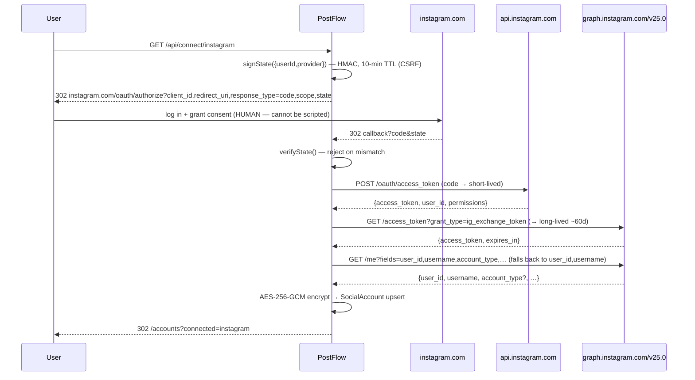
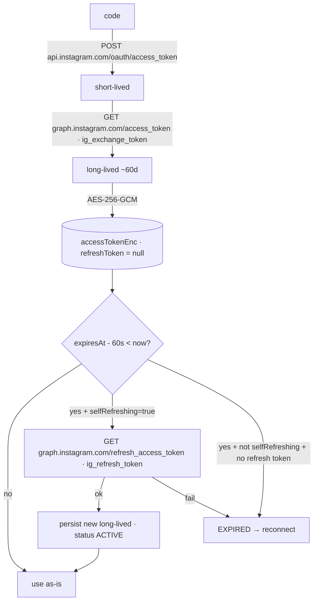
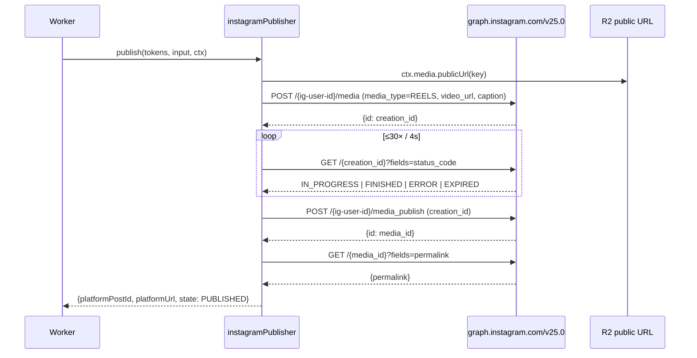

# Instagram Implementation — Documentation Audit

**Date:** 2026-07-17 · **Method:** every endpoint/scope/flow below was checked
against the **live Meta documentation** (fetched during the audit, links in §7),
then the code was updated where it diverged. Divergences found and fixed are in
§8. What could NOT be verified is stated plainly in §9 — nothing here is assumed.

---

## Verified-against-docs summary

| Item | Meta docs | Code | Result |
|---|---|---|---|
| Authorize endpoint | `https://www.instagram.com/oauth/authorize` | same | ✅ |
| Code → short-lived token | `https://api.instagram.com/oauth/access_token` | same | ✅ |
| Short → long-lived (`ig_exchange_token`) | `https://graph.instagram.com/access_token` | same | ✅ |
| Refresh (`ig_refresh_token`) | `https://graph.instagram.com/refresh_access_token` | same | ✅ |
| Create Reel container | `POST /<IG_ID>/media` (`media_type=REELS`, `video_url`, `caption?`) | same | ✅ |
| Publish container | `POST /<IG_ID>/media_publish` (`creation_id`) | same | ✅ |
| Status field / values | `?fields=status_code` → `EXPIRED,ERROR,FINISHED,IN_PROGRESS,PUBLISHED` | same (`FINISHED`=ok, `ERROR/EXPIRED`=fail) | ✅ |
| Graph host | `graph.instagram.com` | same | ✅ |
| Scope names | 4 valid names confirmed | requested 2 (least privilege) | ✅ |
| **API version** | docs show **`v25.0`** | was `v23.0` | ❌ → **fixed to v25.0** |
| **`account_type` on `/me`** | not listed in User-node fields | was requested unconditionally | ❌ → **made resilient** |
| **Self-refresh** | long-lived token self-refreshes, no `refresh_token` | manager forced reconnect | ❌ → **fixed (`selfRefreshing`)** |

## 1. OAuth flow

## 2. Token flow (after fix)

The green `selfRefreshing=true` branch is the fix: before, an Instagram token
(which has no `refresh_token`) hit the red reconnect branch on every expiry.

## 3. Publishing flow

## 4. Every endpoint used

| # | Method | URL | Purpose |
|---|---|---|---|
| 1 | GET | `https://www.instagram.com/oauth/authorize` | consent |
| 2 | POST | `https://api.instagram.com/oauth/access_token` | code → short-lived |
| 3 | GET | `https://graph.instagram.com/access_token?grant_type=ig_exchange_token` | short → long-lived |
| 4 | GET | `https://graph.instagram.com/refresh_access_token?grant_type=ig_refresh_token` | refresh long-lived |
| 5 | GET | `https://graph.instagram.com/v25.0/me?fields=…` | profile + account type |
| 6 | POST | `https://graph.instagram.com/v25.0/{ig-user-id}/media` | create Reel container |
| 7 | GET | `https://graph.instagram.com/v25.0/{creation-id}?fields=status_code` | poll processing |
| 8 | POST | `https://graph.instagram.com/v25.0/{ig-user-id}/media_publish` | publish |
| 9 | GET | `https://graph.instagram.com/v25.0/{media-id}?fields=permalink` | final URL |

`v25.0` ← `INSTAGRAM_API_VERSION` (one env var to bump).

## 5 & 6. Scopes requested + why

| Scope | Required | Why |
|---|---|---|
| `instagram_business_basic` | **Yes** | Baseline. `/me` returns nothing without it → no account id, no username, no `account_type`. Every subsequent call needs the resolved IG user id. |
| `instagram_business_content_publish` | **Yes** | The product itself. Grants `/{ig-user-id}/media` + `/media_publish`. Publishing a Reel is impossible without it. |

`instagram_business_manage_comments` and `instagram_business_manage_messages`
are valid scope names but were **removed**: PostFlow implements no comment or DM
feature, so requesting them violates least privilege and enlarges App Review
(Meta requires a working demo of each requested permission). Re-add them the day
those features ship.

## 7. Documentation links per endpoint

| Endpoint(s) | Meta doc |
|---|---|
| Authorize, token, long-lived, refresh (1–4) | https://developers.facebook.com/docs/instagram-platform/instagram-api-with-instagram-login/business-login |
| Scope names | https://developers.facebook.com/docs/instagram-platform/instagram-api-with-instagram-login · https://developers.facebook.com/docs/permissions |
| `/me` fields (5) | https://developers.facebook.com/docs/instagram-platform/reference/me/ |
| Create container, publish, status (6–8) | https://developers.facebook.com/docs/instagram-platform/content-publishing |
| Permalink field (9) | https://developers.facebook.com/docs/instagram-platform/reference/instagram-media/ |
| Version policy | https://developers.facebook.com/docs/graph-api/changelog |

## 8. Changes applied by this audit

1. **API version `v23.0` → `v25.0`** (`instagram/config.ts`) — matches current docs.
2. **Scopes reduced to the two required** (`instagram/config.ts`) — least privilege.
3. **Capabilities now reflect what's implemented** — `video, image, reels,
   scheduling` (was over-declaring comments/dm/analytics/webhooks).
4. **`selfRefreshing` flag** added to `ProviderConfig`; `TokenManager` honours it;
   Instagram sets it `true` — fixes the false "reconnect required" on every
   token expiry. Covered by a new regression test.
5. **Resilient `fetchProfile`** — if Meta rejects the `account_type` field list,
   it degrades to `user_id,username` instead of failing connect. Account-type
   detection still works when the field is accepted.
6. Tests updated/added: 57 passing (least-privilege scope assertions, v25.0,
   self-refresh regression, personal-account capability gating).

Verified after changes: `tsc --noEmit` clean · `next lint` clean · `next build`
succeeds · `vitest run` 57/57.

## 9. What could NOT be fully verified (honest gaps)

1. **`account_type` on the Instagram-Login `/me`.** The current *IG User node*
   reference lists `id, username, name, profile_picture_url, followers_count,
   media_count, …` and does **not** list `account_type` (nor `user_id`; the id
   field is `id`). But Meta's Instagram-Login getting-started examples *do* use
   `user_id`, and `account_type` is documented for IG accounts elsewhere — the
   two product variants differ and the single authoritative field list for this
   exact node could not be pinned down. Rather than bet connect-breaking behaviour
   on it, `fetchProfile` was made resilient (§8.5). **Confirm the field on your
   own app during the live test and, if present, no further change is needed.**
2. **Real end-to-end run.** Not executed — it needs a human OAuth consent and an
   approved app (see the separate note). A non-mocked script is provided:
   `scripts/instagram-e2e.ts`.
3. **Live scope acceptance.** A probe hit `instagram.com/oauth/authorize` with the
   real `client_id` and confirmed the app id + redirect URI are recognised, but
   Meta defers scope validation until after login, so scope acceptance is only
   provable by completing consent with a real account.
