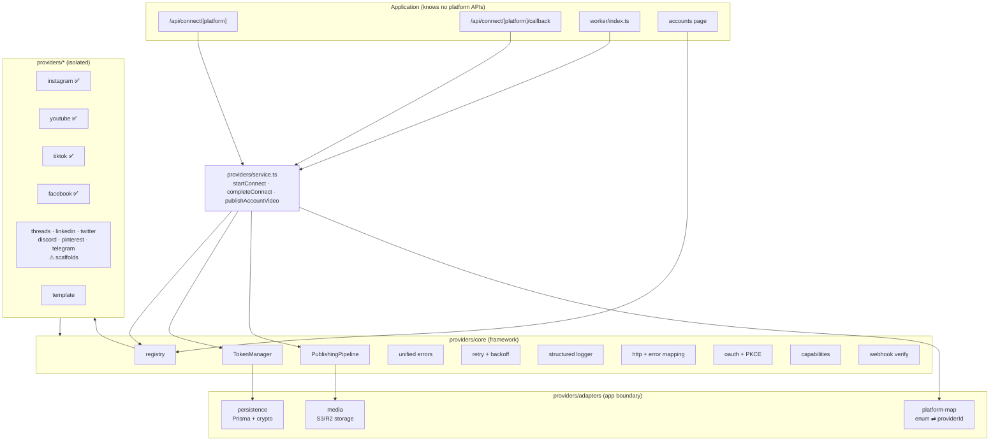

# Provider Architecture — Migration Report

Replaces the deprecated per-platform publisher/OAuth code with a modular,
provider-based authentication & publishing system.

**Status:** complete and verified — `tsc --noEmit` clean, `next lint` clean,
`next build` succeeds, `vitest run` → 54 tests / 8 files passing.

---

## 1. What was removed

| Removed | Why |
|---|---|
| `src/lib/publishers/instagram.ts` | **The bug.** Sent users to `facebook.com/v21.0/dialog/oauth` (Facebook Login) requesting `instagram_business_basic` alongside `pages_show_list` + `business_management`, and required an IG Business account linked to a Facebook Page. That product is deprecated → **"Invalid Scopes"**. Deleted outright, not patched. |
| `src/lib/publishers/youtube.ts` | Logic migrated to `src/providers/youtube/`. |
| `src/lib/publishers/tiktok.ts` | Logic migrated to `src/providers/tiktok/`. |
| `src/lib/publishers/types.ts` | Old `Publisher` interface + `PlatformNotVerifiedError`; superseded by `providers/core/types.ts` + the unified error hierarchy. |
| `src/lib/publishers/index.ts` | Old hardcoded `getPublisher()` registry; superseded by `providers/core/registry.ts`. |
| `src/lib/publishers/google-oauth.ts` | Folded into `providers/youtube/client.ts` (config now owns scopes). |
| `src/lib/publishers/content.ts` | **Moved** to `src/lib/content.ts` — it is app-domain (post → text), not provider logic. |
| `src/lib/social-accounts.ts` | `ensureFreshTokens` was ad-hoc refresh logic living next to Prisma. Replaced by `TokenManager` + `adapters/persistence.ts` + `service.ts`. |

Nothing references the deleted modules (verified by grep + a clean build).

## 2. What changed

| Area | Before | After |
|---|---|---|
| **Structure** | One file per platform under `lib/publishers` | `src/providers/<platform>/` folders + `core/` framework |
| **Registry** | Hardcoded `Record<Platform, Publisher>` | String-keyed `registry.ts`; providers register themselves |
| **Instagram auth** | Facebook Login + deprecated scopes | **Instagram API with Instagram Login** — `instagram.com/oauth/authorize`, `instagram_business_*` only, no Facebook Page required |
| **Auth interface** | `getAuthUrl/connect/refresh` | `getAuthorizationUrl / exchangeCode / refreshToken / revoke / validateToken / fetchProfile / fetchCapabilities` |
| **Tokens** | `ensureFreshTokens()` helper | `TokenManager`: auto-refresh, rotation, expiry skew, reconnect detection, scope validation |
| **Publishing** | Worker called `publisher.publish()` directly | `PublishingPipeline` — uniform retry, error mapping, structured logs |
| **Errors** | Raw `Error` strings | 11-class unified hierarchy with `code`/`retryable`/`toUserMessage()` |
| **Retry** | None (BullMQ-level only) | `withRetry` — exponential backoff + jitter, honours `Retry-After` |
| **Logging** | `console.log` | Structured JSON logger with domains + secret redaction |
| **Config** | Constants inline in publisher files | Per-provider `config.ts`: `apiVersion`, `baseUrl`, `authUrl`, `tokenUrl`, `scopes`, `capabilities`, `endpoints`, `credentials()` |
| **Capabilities** | Didn't exist | 14-capability model; **UI renders from it** (no hardcoded platform rules) |
| **PKCE / CSRF** | Signed state only | Signed state **+** PKCE (S256) via httpOnly cookie, per-provider `usesPkce` |
| **Account type** | Unknown | Auto-detected personal / creator / business; personal IG loses publish capabilities |
| **Secrets** | Read at import | `credentials()` reads env **per call** → rotation without rebuild |
| **Tests** | None | vitest: 54 tests (errors, retry, token refresh, OAuth/PKCE, publishing, webhooks, registry, capabilities) |

### Why

- **Isolation** — a platform's quirks (TikTok's `client_key`, IG's two-step long-lived
  token, FB's Page tokens) stay inside its folder. The app sees one interface.
- **Survivability** — API versions/endpoints/scopes are data in one `config.ts`.
  A Graph version bump is a one-line change, not a grep across the codebase.
- **Correctness** — providers never touch Prisma/storage; they receive a
  `MediaResolver` and a `TokenSet`. That makes them unit-testable without a DB.
- **Security** — tokens encrypted at rest (unchanged), PKCE added, secrets
  redacted from logs, webhook HMAC verification is constant-time, and the
  Facebook long-lived **user** token is now stored as the *encrypted* refresh
  token instead of plaintext metadata (a real leak the old shape invited).

## 3. Architecture



**Publish flow:** `worker` → `service.publishAccountVideo` →
`TokenManager.getFreshTokens` (refresh + persist if needed) →
`PublishingPipeline.publish` (retry + map errors) → `provider.publisher.publish`
(platform API) → normalized `PublishResult`.

**Connect flow:** `/api/connect/:id` → `service.startConnect` (signed state +
optional PKCE → httpOnly cookie) → platform consent →
`/api/connect/:id/callback` → `service.completeConnect` (verify state →
`exchangeCode` → encrypt + upsert account).

## 4. Project structure

```
src/providers/
├── core/                  # the framework — no platform knowledge
│   ├── types.ts           # AuthProvider, Publisher, WebhookHandler, SocialProvider…
│   ├── errors.ts          # 11 unified error classes
│   ├── logger.ts          # structured JSON logs + redaction
│   ├── retry.ts           # exponential backoff + jitter
│   ├── http.ts            # fetch + HTTP→unified-error mapping
│   ├── oauth.ts           # PKCE, nonce, URL building, scope diffing
│   ├── capabilities.ts    # 14 capabilities
│   ├── config.ts          # env readers, credentials(), endpoint resolution
│   ├── registry.ts        # source of truth for providers
│   ├── token-manager.ts   # refresh · rotation · reconnect · scope validation
│   ├── publishing.ts      # universal pipeline
│   ├── webhooks.ts        # HMAC verification
│   ├── base-oauth2.ts     # shared OAuth2 code-flow building blocks
│   └── scaffold.ts        # turns a config into a conformant provider
├── adapters/              # the ONLY place the framework meets the app
│   ├── platform-map.ts    # Prisma enum ⇄ providerId
│   ├── persistence.ts     # Prisma + AES-256-GCM token storage
│   └── media.ts           # storage-backed MediaResolver
├── instagram/  {config,auth,publisher,index}.ts     ✅ real
├── youtube/    {config,client,auth,publisher,index}.ts ✅ real
├── tiktok/     {config,auth,publisher,index}.ts     ✅ real
├── facebook/   {config,index}.ts                    ✅ real
├── threads|linkedin|twitter|discord|pinterest|telegram/index.ts  ⚠ scaffold
├── template/index.ts      # copy me to add a platform
├── service.ts             # app-facing API
├── ui.ts                  # descriptors for server components
└── index.ts               # registration barrel
tests/providers/           # 54 tests, incl. mock-provider.ts
```

## 5. Adding a platform

1. `cp -r src/providers/template src/providers/<name>`
2. Fill `config.ts` (version, endpoints, scopes, capabilities, credentials).
3. Implement `auth` + `publisher` (or leave the scaffold and finish later).
4. Add one line to `src/providers/index.ts`.
5. **Only if it must be connectable:** add the `Platform` enum value + two lines
   in `adapters/platform-map.ts` + an entry in `lib/platforms.ts`.

Steps 1–4 require no changes to business logic, the worker, or the routes.

## 6. Remaining limitations (honest)

1. **The DB `Platform` enum is the one non-folder touch-point.** The framework is
   string-keyed and needs no schema change, but `SocialAccount.platform` is a
   Prisma enum used across billing/posts/admin. Only `youtube`/`tiktok`/
   `instagram` map today. Full "zero existing-code changes" would require
   migrating that column to `String` (registry becomes the validator) — a
   deliberate, separate migration; it was **not** done here to avoid destabilising
   a live database and unrelated subsystems.
2. **Scaffolds are not live.** threads · linkedin · twitter · discord · pinterest ·
   telegram build real authorize URLs but throw `NotImplementedError` on
   `exchangeCode`/`publish`. They are honest placeholders, not working
   integrations.
3. **Telegram is not OAuth2** (Bot API: bot token + chat id). Its scaffold
   reserves the folder; a real implementation needs a bot-token `AuthProvider`.
4. **WhatsApp / Slack / Reddit / Snapchat were not scaffolded** — WhatsApp is
   messaging, Snapchat publishing is partner-gated. Fake folders would have been
   noise; the template covers them when genuinely needed.
5. **Platform app review still gates real posting.** Instagram/TikTok/Facebook
   need approved apps; accounts connect as `PENDING_VERIFICATION` until
   `INSTAGRAM_APPROVED` / `TIKTOK_APPROVED` / `FACEBOOK_APPROVED` is `true`.
   This is a platform policy, not a code limitation.
6. **`uploadMedia` / `schedule` / `cancel` are deliberately not provider methods.**
   Every current platform requires upload+publish as one transaction, and
   scheduling/cancel are ours (BullMQ), not the platform's. `delete`/`update` are
   optional on `Publisher` and gated by capability.
7. **Webhooks: primitives only.** `WebhookHandler` + verified HMAC exist and are
   tested; no provider ships a live webhook route yet.
8. **Instagram requires a publicly fetchable media URL** (R2 public bucket) —
   unchanged pre-existing constraint.
9. **No live end-to-end tests against real platform APIs** (they need real
   credentials + approved apps). Tests cover the framework and the URL/scope
   contract that caused the outage.
10. **Secret rotation** is supported for *provider credentials* (read per call).
    Rotating `TOKEN_ENCRYPTION_KEY` still needs a re-encryption script (not built).

## 7. Future extension points

- `providers/template/` — the copy-paste entry point.
- `registry.ts` — add providers without touching consumers.
- `CapabilityMap` — add a capability; the UI picks it up automatically.
- `TokenPersistence` port — swap Prisma for anything.
- `MediaResolver` port — swap S3/R2 for anything.
- `WebhookHandler` — implement per provider + one generic route.
- `base-oauth2.ts` — new standard-OAuth2 platforms are near-zero code.
- `config.credentials()` — per-call env read enables live secret rotation.

## 8. Required configuration for Instagram to actually work

The code no longer requests deprecated scopes, but the Meta app must be set up
for the **new** product:

1. Meta app → **Products → Instagram → API setup with Instagram login**.
2. **Business login settings** → OAuth redirect URI:
   `https://postflow.lol/api/connect/instagram/callback`
3. Copy the **Instagram App ID / Secret** into env:
   ```
   INSTAGRAM_APP_ID=...
   INSTAGRAM_APP_SECRET=...
   ```
   (falls back to `META_APP_ID` / `META_APP_SECRET` for single-app setups)
4. The Instagram account must be **Business or Creator** (personal cannot publish).
5. After app review passes: `INSTAGRAM_APPROVED=true`, then reconnect.

Optional per-provider version overrides (one env each, no code change):
`INSTAGRAM_API_VERSION`, `FACEBOOK_API_VERSION`, `YOUTUBE_API_VERSION`,
`TIKTOK_API_VERSION`, `THREADS_API_VERSION`, …
